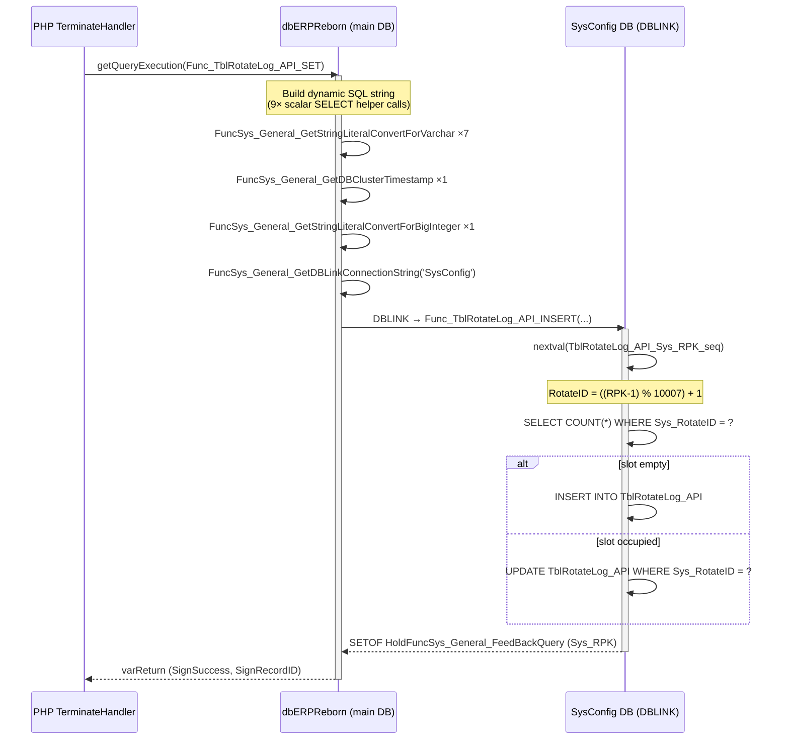
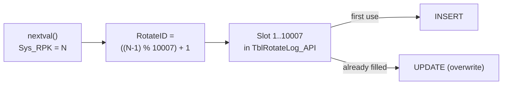
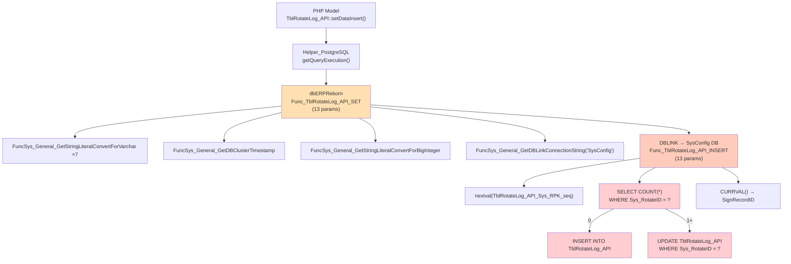
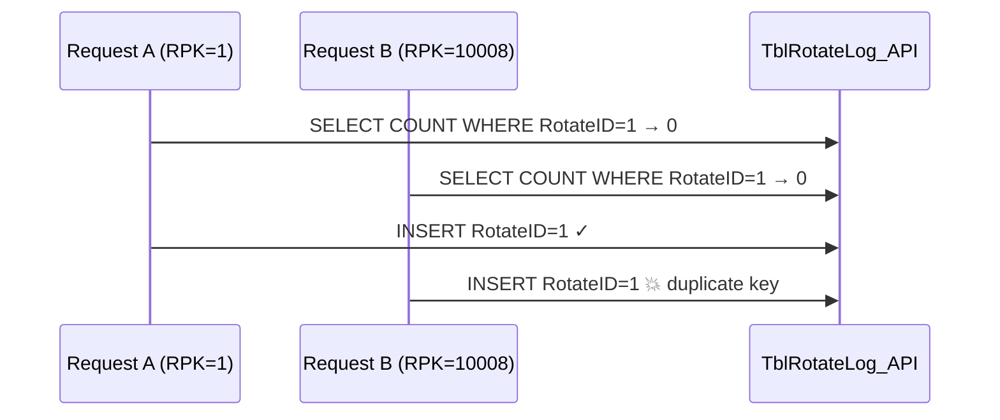
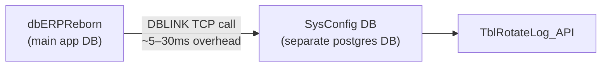
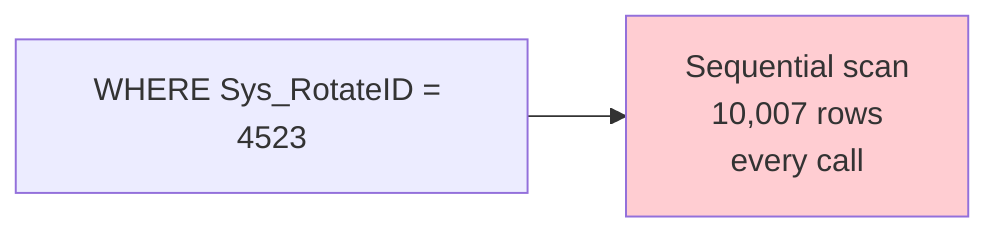
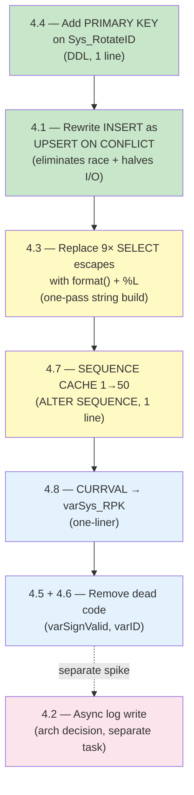

# Analysis — `Func_TblRotateLog_API_SET` & Rotate-Log Architecture

| Field       | Value                                               |
|-------------|-----------------------------------------------------|
| Date        | 2026-04-21                                          |
| Analyst     | Claude (claude-sonnet-4-6)                          |
| Component   | `SchSysConfig.Func_TblRotateLog_API_SET` / `_INSERT` |
| Trigger     | Performance investigation — TerminateHandler overhead |

---

## 1. What It Does

Every HTTP request passes through two middleware layers. On the way **out** the `TerminateHandler` writes a full audit record (IP, URL, headers, body, status, timing) into a fixed-size circular buffer called `TblRotateLog_API`.



---

## 2. The Circular Buffer (Rotate) Logic

The table holds exactly **10,007 rows** — one slot per possible `Sys_RotateID`. The global sequence `Sys_RPK` climbs without bound; the slot index is derived via modulo:

```
Sys_RotateID = ((Sys_RPK − 1)  mod  10007) + 1
```

This maps:

| Sys_RPK | Sys_RotateID |
|---------|-------------|
| 1       | 1           |
| 2       | 2           |
| …       | …           |
| 10007   | 10007       |
| 10008   | **1** (wrap)  |
| 10009   | **2** (wrap)  |

Once all 10,007 slots are filled every new entry **overwrites** the oldest. No `DELETE`, `TRUNCATE`, or partition switching is needed — the table stays permanently capped.

The prime number 10007 avoids alignment artifacts that power-of-2 moduli produce with typical OS I/O page sizes.



---

## 3. Full Call Chain



---

## 4. Problems Found

### 4.1 CRITICAL — SELECT COUNT + INSERT/UPDATE instead of UPSERT (race condition)

```sql
-- Current (unsafe):
SELECT COUNT("Sys_RotateID") INTO varSignExist
FROM "SchSysConfig"."TblRotateLog_API"
WHERE "Sys_RotateID" = varSys_RotateID;

IF (varSignExist = 0) THEN
    INSERT INTO ...
ELSE
    UPDATE ... WHERE "Sys_RotateID" = varSys_RotateID;
END IF;
```

**Two problems arise:**

1. **Race condition** — Two concurrent requests whose `Sys_RPK` values map to the same slot (e.g. RPK=1 and RPK=10008 both → slot 1) can both pass the `COUNT=0` check and both attempt `INSERT`, causing a duplicate-key violation or silent corruption.
2. **Double I/O** — One `SELECT` + one `INSERT`/`UPDATE` where a single atomic statement would do.



**Fix — use PostgreSQL native UPSERT:**

```sql
INSERT INTO "SchSysConfig"."TblRotateLog_API" (
    "Sys_RotateID", "Sys_RPK", "Sys_Data_Annotation",
    "Sys_Data_Entry_LoginSession_RefID", "Sys_Data_Entry_DateTimeTZ",
    "HostIPAddress", "URL", "NavigatorUserAgent",
    "RequestDateTimeTZ", "RequestHTTPHeader", "RequestHTTPBody",
    "ResponseDateTimeTZ", "ResponseHTTPStatus", "ResponseHTTPHeader", "ResponseHTTPBody"
) VALUES (
    varSys_RotateID, varSys_RPK, varSysDataAnnotation, ...
)
ON CONFLICT ("Sys_RotateID") DO UPDATE SET
    "Sys_RPK"                          = EXCLUDED."Sys_RPK",
    "Sys_Data_Annotation"              = EXCLUDED."Sys_Data_Annotation",
    "Sys_Data_Entry_LoginSession_RefID"= EXCLUDED."Sys_Data_Entry_LoginSession_RefID",
    "Sys_Data_Entry_DateTimeTZ"        = EXCLUDED."Sys_Data_Entry_DateTimeTZ",
    "HostIPAddress"                    = EXCLUDED."HostIPAddress",
    "URL"                              = EXCLUDED."URL",
    "NavigatorUserAgent"               = EXCLUDED."NavigatorUserAgent",
    "RequestDateTimeTZ"                = EXCLUDED."RequestDateTimeTZ",
    "RequestHTTPHeader"                = EXCLUDED."RequestHTTPHeader",
    "RequestHTTPBody"                  = EXCLUDED."RequestHTTPBody",
    "ResponseDateTimeTZ"               = EXCLUDED."ResponseDateTimeTZ",
    "ResponseHTTPStatus"               = EXCLUDED."ResponseHTTPStatus",
    "ResponseHTTPHeader"               = EXCLUDED."ResponseHTTPHeader",
    "ResponseHTTPBody"                 = EXCLUDED."ResponseHTTPBody";
```

Requires `Sys_RotateID` to have a `PRIMARY KEY` or `UNIQUE` constraint (see §4.4).

---

### 4.2 CRITICAL — DBLINK cross-database call on every request

The outer `_SET` function lives in `dbERPReborn` but the actual table and `_INSERT` function live in a separate `SysConfig` database. Every API request pays the cost of a cross-database DBLINK call.



**Cost per request:**
- Fetch connection string from `FuncSys_General_GetDBLinkConnectionString` (another SELECT)
- Open or reuse a DBLINK connection
- Serialize 13 parameters as string literals
- Remote parse + execute round trip
- Return SETOF result deserialization

Since `TerminateHandler` is synchronous, this adds directly to response latency at P99.

**Remediation options (in order of complexity):**
1. Move `TblRotateLog_API` into `dbERPReborn` — eliminates DBLINK entirely
2. Make the log write async (fire-and-forget via `pg_notify` + background worker)
3. Batch log writes through a Redis queue consumed by a background process

---

### 4.3 HIGH — 9 scalar SELECT calls to build the dynamic SQL string

Inside `Func_TblRotateLog_API_SET`, the SQL string is assembled by calling escape-helper functions as inline subqueries:

```sql
varSQL := '... ' ||
    (SELECT "SchSysConfig"."FuncSys_General_GetStringLiteralConvertForVarchar"(varHostIPAddress::varchar)) ||
    '::cidr, ' ||
    (SELECT "SchSysConfig"."FuncSys_General_GetStringLiteralConvertForVarchar"(varURL::varchar)) ||
    ...
```

That is **9 separate executor invocations** before the DBLINK even opens. PostgreSQL's `format()` with `%L` (literal quoting) handles this in a single expression with no additional round trips:

```sql
varSQL := format(
    'SELECT "SignRecordID" FROM "SchSysConfig"."Func_TblRotateLog_API_INSERT"(
        %L::varchar, %s::bigint, %L::timestamptz,
        %L::cidr, %L::varchar, %L::varchar,
        %L::timestamptz, %L::json, %L::varchar,
        %L::timestamptz, %s::smallint, %L::json, %L::varchar
    )',
    varSysDataAnnotation, varIDSession,
    (SELECT "SchSysConfig"."FuncSys_General_GetDBClusterTimestamp"()),
    varHostIPAddress::varchar, varURL, varNavigatorUserAgent,
    varRequestDateTimeTZ::varchar, varRequestHTTPHeader::varchar, varRequestHTTPBody,
    varResponseDateTimeTZ::varchar, varResponseHTTPStatus,
    varResponseHTTPHeader::varchar, varResponseHTTPBody
);
```

---

### 4.4 HIGH — No index on `Sys_RotateID`

The `SELECT COUNT` and `UPDATE ... WHERE "Sys_RotateID" = ?` both filter on `Sys_RotateID`, but no primary key or index is defined on that column in the table DDL. With 10,007 rows this is a **full sequential scan on every single API request**.



**Fix:**
```sql
-- On the SysConfig DB (where the real table lives):
ALTER TABLE "SchSysConfig"."TblRotateLog_API"
    ADD PRIMARY KEY ("Sys_RotateID");
```

This also satisfies the `ON CONFLICT` requirement for fix §4.1.

---

### 4.5 MEDIUM — Dead code: `varSignValid` guard is always true

```sql
varSignValid := 0;        -- set unconditionally

IF (varSignValid=0) THEN  -- can never be false
    ...
END IF;
```

`varSignValid` is never modified after initialization. The branch exists as scaffolding for a validation path that was never implemented. The `IF` wrapping adds noise and false implication that the block is conditional.

---

### 4.6 MEDIUM — `varID` ($2) is a dead parameter

```sql
-- In Func_TblRotateLog_API_SET:
varID ALIAS FOR $2;  -- declared, never used in body
```

PHP callers pass a value that is silently discarded. The parameter should be removed from the function signature (and all call sites updated) or documented if intentionally reserved.

---

### 4.7 MEDIUM — Sequence CACHE = 1

```sql
CREATE SEQUENCE "SchSysConfig"."TblRotateLog_API_Sys_RPK_seq"
    CACHE 1;   -- acquires catalog lock on every nextval()
```

Under concurrent load, multiple sessions calling `nextval()` serialize on the sequence catalog entry. Setting `CACHE 10` or higher pre-allocates a batch of IDs per session, reducing catalog contention:

```sql
ALTER SEQUENCE "SchSysConfig"."TblRotateLog_API_Sys_RPK_seq" CACHE 50;
```

Note: with CACHE > 1, gaps will appear in `Sys_RPK` after a server restart. For an audit log this is acceptable.

---

### 4.8 LOW — CURRVAL used when `varSys_RPK` is already in scope

```sql
-- Current:
varRecSetOutput."SignRecordID" := CURRVAL('"SchSysConfig"."TblRotateLog_API_Sys_RPK_seq"');

-- Better: variable is already in scope, no catalog lookup needed
varRecSetOutput."SignRecordID" := varSys_RPK;
```

---

## 5. Issues Summary

```mermaid
quadrantChart
    title Severity vs Implementation Effort
    x-axis Easy --> Hard
    y-axis Low Impact --> High Impact
    quadrant-1 High value, quick wins
    quadrant-2 Strategic investments
    quadrant-3 Low priority
    quadrant-4 Avoid unless forced

    Add PK on Sys_RotateID: [0.15, 0.90]
    Rewrite as UPSERT: [0.25, 0.88]
    Replace 9x SELECT with format(): [0.20, 0.60]
    Increase SEQUENCE CACHE: [0.10, 0.45]
    Replace CURRVAL with varSys_RPK: [0.05, 0.15]
    Remove dead varID param: [0.30, 0.20]
    Remove varSignValid dead code: [0.10, 0.10]
    Move table to dbERPReborn: [0.85, 0.95]
    Async log via Redis queue: [0.90, 0.92]
```

| # | Severity | Issue | Effort |
|---|----------|-------|--------|
| 4.1 | **Critical** | SELECT COUNT + INSERT/UPDATE — race condition + double I/O | Low (requires PK from 4.4) |
| 4.2 | **Critical** | DBLINK cross-DB call on every request | High (arch decision) |
| 4.3 | **High** | 9 scalar SELECT calls to build SQL string | Low (use `format()`) |
| 4.4 | **High** | No index on `Sys_RotateID` — full table scan every write | Low (one DDL statement) |
| 4.5 | **Medium** | `varSignValid=0` guard always true — dead code | Low (cleanup) |
| 4.6 | **Medium** | `varID` ($2) declared but never used | Medium (signature + callers) |
| 4.7 | **Medium** | SEQUENCE CACHE=1 — catalog lock per call | Low (one ALTER) |
| 4.8 | **Low** | CURRVAL used instead of in-scope `varSys_RPK` | Low (one-liner) |

---

## 6. Recommended Fix Order



Steps 4.4 → 4.1 are the highest-leverage pair: a single `ALTER TABLE ... ADD PRIMARY KEY` unlocks the atomic `UPSERT`, eliminates the race condition, and halves the per-request write I/O. These two together are the recommended immediate action.
